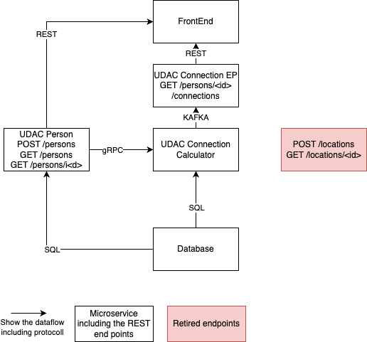

# Architecture description

## Architecture overview

## Components

### Frontend
The frontend will be reused with minor changes in regards to the endpoints called.

### UDAC Person
Microservice to deliver everything around the resource "person". For the start it will be possible to:
- create a new person (POST /persons)
- get all persons (GET /persons)
- get a dedicate person via an id (GET /persons(<id>))

### UDAC Connection Calculator
Microservice to recieve connections for a dedicated person. It implements the command pattern on a resource based API.
The URL will be GET /persons/<id>/connections and it returns the calculated persons meet somewhere.

### Reporting Queue
Kafka Queue to contain the call towards the GET and POST /persons as awl as the GET /person/<id> endpoint. 

### Database
Database will stay the same as in previous version. There are no changes planed to this component.

## Architecture Decisions
### ADR1: Retirement of end points
Since there is no need for creating or receiving the location for the MVP, therefore no  need to implement this method in this MVP.
If there is a need to use these end points by other applications, the POC still can be deployed and reused.

## ADR2: Use a single database
The time constraints to implement the solution within a short time range dictates the usage of a single database, instead of splitting it up.
This needs to be revisited on the next iteration.

### ADR3: Introduction of Kafka
The requirement to know about the number of calls of some of the end points on the person resource results into a queue that receives this information. In case of scaling of the UDAC Person mircoservice the queue will help to mitigate concurrent writing into a database.

### ADR4: Using gRPC
gRPC is known for the fast implementation, and so we use this interface between the UDAC Connection Calculator and the UDAC Person microservice as a way to have quicker responses than using the REST interface.

