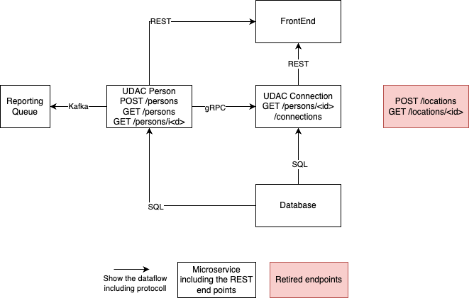

# Architecture description

## Architecture overview

## Components

### Frontend
The frontend will be reused with minor changes in regards to the endpoints called.

### UDAC Person
Microservice to deliver everything around the resource "person". For the start it will be possible to:
- create a new person (POST /persons)
- get all persons (GET /persons)
- get a dedicate person via an id (GET /persons(<id>))

### UDAC Connection EP
Microservice to recieve connections for a dedicated person. It implements the command pattern on a resource based API.
The URL will be GET /persons/<id>/connections

### UDAC Connection Calculator
Microservice responsible for the calculation of the connection of a person to other persons.

### Database
Database will stay the same as in previous version. There are no changes planed to this component.

## Architecture Decisions
### ADR1: Retirement of end points
Since there is no need for creating or receiving the location for the MVP, therefore no  need to implement this method in this MVP.
If there is a need to use these end points by other applications, the POC still can be deployed and reused.

## ADR2: Use a single database
The time constraints to implement the solution within a short time range dictates the usage of a single database, instead of splitting it up.
This needs to be revisited on the next iteration.

### ADR3: Introduction of Kafka
In the front end the customer can select a person and the view the connections. Theses connections can be many, many and therefore the connection end point is 
decoupled from the calculation. A queue is introduced to enable a fast calcultion and reducing the resource usage.

### ADR4: Using gRPC
gRPC is known for the fast implementation, and so we use this interface between the UDAC Connection Calculator and the UDAC Person microservice as a way to have quicker responses than using the REST interface.

